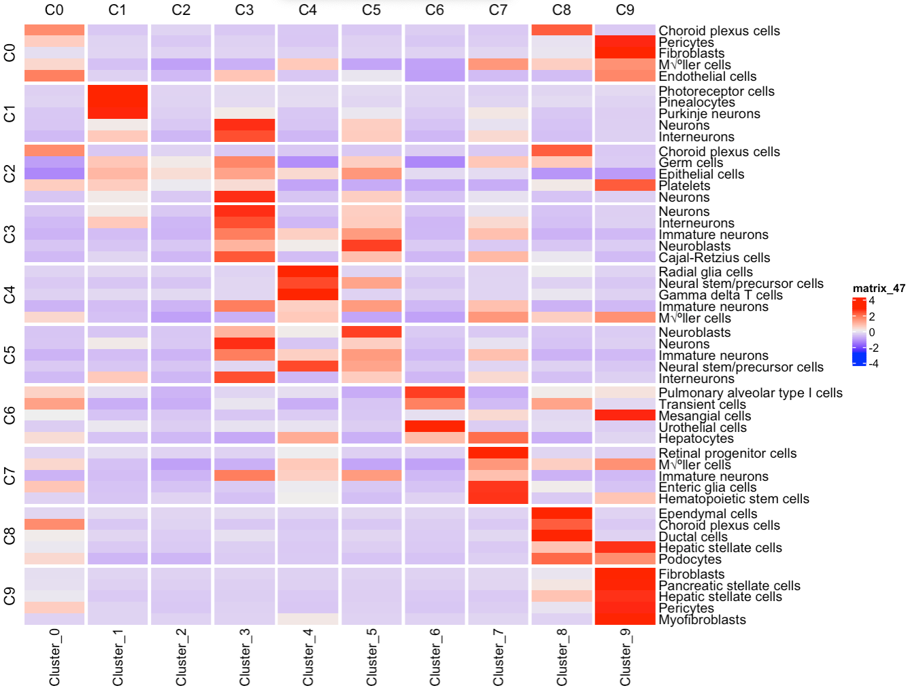

# identify_scRNAseq_cluster_celltype

Identify the cell types for single-cell RNA-seq. Cell type-specific markers list is from Panglao DB. 

p-value is calculated using chi-sq test

Result is represented as heatmap

